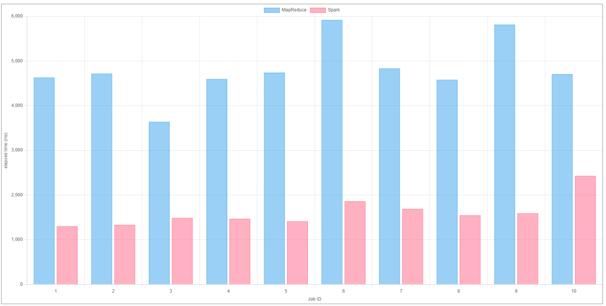

# MapReduce vs Spark Tracker

This project is a quick proof of concept for the comparison of Apache Spark vs Hadoop MapReduce framework. It is believed that the spark programming model allows analysis of big data to be up 100x faster than Mapreduce, as Spark benefits from in memory data processing, hence significantly reducing the overhead for file I/O operations.

## but why?

For science! 

## About the job

The job that Apache spark and Mapreduce has to compute, is an emulation of a batch analysis for IOT devices. It's responsible for reading datasets of multiple sizes and compute the user's daily usage of IOT devices in a given household. These jobs are located in the example_jobs folder for demonstrating how the timestamps are collected using webhooks. One can implement jobs according to any given requirements, triggering the /update webhook to measure the elapsed time of job execution (refer to implementation examples in example_jobs).

Sample screenshots:




## System Requirements
This project assumes the correct installation of python, FastAPI, pip, foreman, hdfs, spark and JDK. .env file should also be populated with keys "API_BASE_URL" and "API_DOMAIN". A little redundant, but new changes/refactoring will be pushed soon!


```
$ pip install -r requirements.txt // downloading all dependencies into your python environment
$ foreman start // start web server
$ hdfs dfs -copyFromLocal <file_path_to_mapreduce_jar_file> <target_location_on_hdfs> // copy map reduce jar file to hadoop file system
$ hadoop jar <jar_file_path> <entry_class> // run jar file
```

